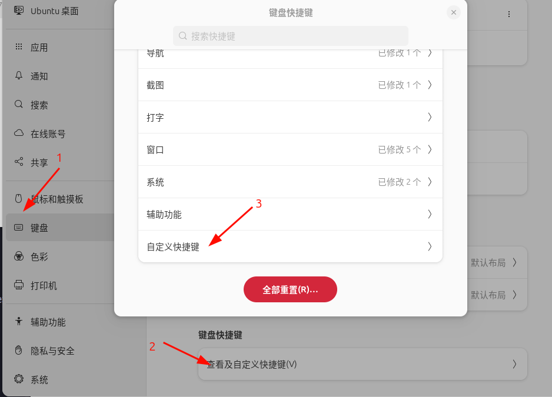
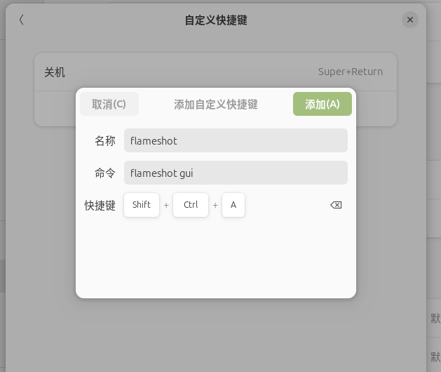

[toc]


# Flameshot
## 简介
&emsp;[Flameshot](https://flameshot.org/#download)是一个很好的截图工具，支持截图编辑、置顶操作。支持windows/macOS/Linux。
## 下载
### ubuntu
```shell
sudo apt install flameshot
```
## 基础用法
基础用法参考[基础操作](https://docs.snipaste.com/zh-cn/getting-started)
## 常用快捷操作
* 截图  
在ubuntu系统上设置截图快捷键


* 置顶  
可在clameshot的配置选项中配置，笔者配置为`<space>`  
* 置顶后取消  
**双击** 被置顶的图片

# 避坑
## ubuntu配置flameshot截图快捷键后无效
解决办法有两种：
* [官方给出的办法](https://flameshot.org/docs/guide/wayland-help/)：通过脚本运行`flameshot gui`
```shell
script --command "QT_QPA_PLATFORM=wayland flameshot gui" /dev/null
# or
bash -c -- "QT_QPA_PLATFORM=wayland flameshot gui"
# or
sh -c -- "QT_QPA_PLATFORM=wayland flameshot gui"
```
* 其他办法：
    * 1. 在登陆账户时，在屏幕左下角有个设置图标,点击图标
    * 2. 在显示的session中选择 **ubuntu on xorg**
    * 3. 登陆账户即可

